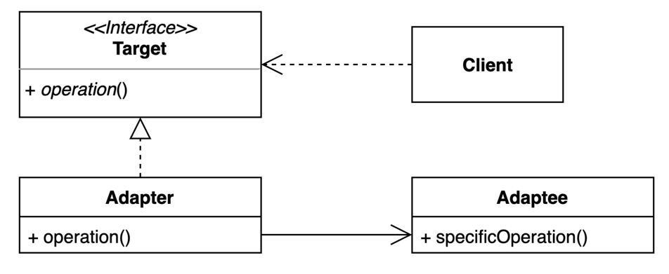

# [구조적인 패턴] Adapter Pattern

- 클라이언트가 사용하는 인터페이스가 전혀 다른 경우,
- Spring Security가 제공하는 security package가 클라이언트가 사용하는 타겟 인터페이스고, 우리가 가지고 있는 Account 서비스가 Adaptee라고 할 때, 이 둘을 연결시켜주는
  Adapter의 구현이 필요하다.
- Account와 UserService, Account와 UserDetails를 어떻게 연결할것인가?

- Adaptee 클래스를 직접 수정가능한 경우, Adapter를 별도의 클래스로 만들지 않고 기존 Adaptee Class에서 타겟 인터페이스를 구현할 수도 있다.
- 이 때, 장점은 별도의 어댑터 클래스를 만들지 않아도되어서, 코드와 복잡도를 조금 줄일 수 있지만, SRP 측면에서 보자면 클래스를 나누는게 좋다.
- 이 때, 단점은 기존 코드(Adaptee)를 우리가 원하는 특정 타겟 인터페이스를 구현하게끔 변경해야 한다.

## 장단점

### 장점

- 기존 코드를 변경하지 않고 원하는 인터페이스 구현체를 만들어 재사용할 수 있다.(OCP)
- 기존 코드가 하던 일과 특정 인터페이스 구현체로 변환하는 작업을 각기 다른 클래스로 분리하여 관리할 수 있다.(SRP)

### 단점

- 새 클래스가 생겨 복잡도가 증가할 수 있다. 경우에 따라서는 기존 코드가 해당 인터페이스를 구현하도록 수정하는 것이 좋은 선택이 될 수도 있다

## 실무

### Java

- Arrays.asList()는 배열을 List로 변겨해준다. `public static <T> List<T> asList(T... a)`
- java.util.Collections#list(Enumeration), java.util.Collections#enumeration()
- java.io.InputStreamReader(InputStream)
- java.io.OutputStreamWriter(OutputStream)

### Spring Framework

- Spring Security UserDetailsService
- Spring MVC HandlerAdapter : 우리가 작성하는 다양한 형태의 핸들러 코드를 스프링 MVC가 실행할 수 있는 형태로 변환해주는 어댑터용 인터페이스.