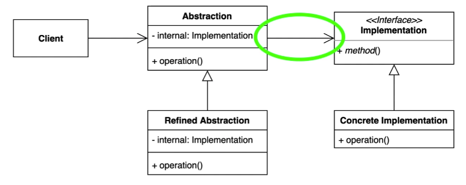

# [구조적인 패턴] Bridge Pattern

- 추상적인 것과 구체적인 것을 분리하여 연결하는 패턴
- 나누어진 두 개를 연결!

역할

- Client: Abstraction을 사용하는 코드
- Abstraction: 고차원의 추상적인 로직을 담고 있는 부분
- Implementation : 구제적인 상태, 액션 등을 포함하고 있는 부분

클라이언트는 추상적인 계층구조만 사용할 것이다.

- 동작이나 액션에 해당하는 부분은 Champion Interface에 남겨두고,
- 스킨, 외관, 스킬에 대당하는 부분은 분리해서 또 다른 계층으로 만든다면 브릿지 패턴으로 개선이 가능하다.

## 장단점

### 장점

- 추상적인 코드를 구체적인 코드 변경 없이도 독립적으로 확장할 수 있다.(OCP, SRP)
- 추상적인 코드과 구체적인 코드를 분리하여 수 있다.

### 단점

- 계층 구조가 늘어나 복잡도가 증가할 수 있다.

## 실무

### JAVA JDBC

- DriverManager 가 추상적인 부분이고, java.Driver interface를 사용한다.
- `java.Driver`는 `org.h2.Driver`나 mysql.Driver 등 다양한 드라이버가 될 수 있다.
- Connection, DriverManager, Statement는 추상화쪽,
- Driver는 구체적인 Implementation 쪽을 담당한다.
- 새로운 DB가 만들어지더라도 JDBC 코드를 바꿀 필요가 없어진다. (OCP)

### Slf4j, 로깅 퍼사드와 로거

### Spring Framework의 Portable Service Abstraction

- EmailSender
- PlatformTransactionManager : TransactionTemplate이 추상적인 부분, PlatformTransactionManager이 구체적인 부분을 담당한다.