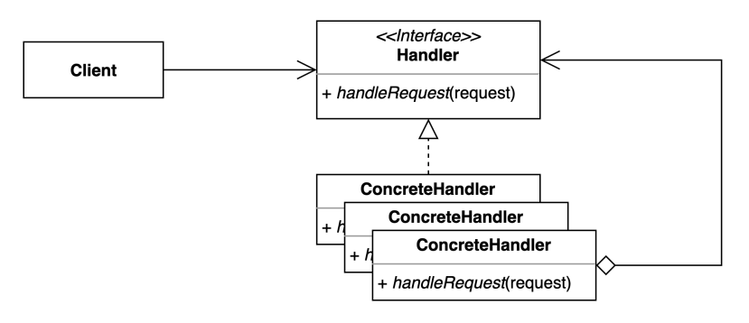

# [행동 관련 패턴] Chain of Responsibility (책임 연쇄 패턴)

- 요청을 보내는 쪽(sender)과 요청을 처리하는 쪽(receiver)을 분리하는 패턴
- 핸들러 체인을 사용해서 요청을 처리한다.
- 클라이언트는 구체적인 Handler Type 아니라 Handler 인터페이스만 알면된다.
- 클라이언트 코드가 Handler와 디커플링 되어있다는 것이 포인트다!

## 장단점

### 장점

- 클라이언트 코드를 변경하지 않고, 얼마든지 새로운 핸들러를 체인에 추가할 수 있고, 순서를 바꿀 수 있다.(OCP)
- 각각의 핸들러마다 각자의 책임/역할을 가질 수 있다.(SRP)

### 단점

- 연쇄적으로 흘러가다보니 코드의 흐름이 많아져 디버깅이 번거로울 수 있다.(체인 순서 등을 고려해야함)

## 실무

### Java Servlet Filter

### Spring Security Filter
