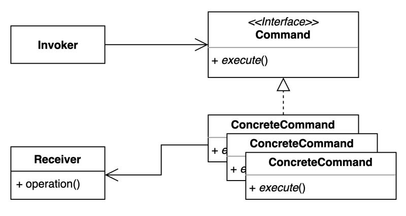

# [행동 관련 패턴] Command Pattern

- 요청을 캡슐화하여 호출자(invoker)와 수신자(receiver)를 분리하는 패턴
- 요청을 처리하는 방법이 바뀌더라도, 호출자의 코드는 변경되지 않는다.
- 수신자(receiver)의 커플링이 강해서 사용하게 되는 패턴이다.
- 수신자(receiver) 코드가 변경되었을 때, Command쪽 코드는 바뀌지 않을 수 없다. Invoker 코드가 안바뀌는게 중요한 것이다.
- 여러 Invoker에서 만들어져 있는 Commander들을 재사용할 수 있다.
- 여러 Invoker에서 Commander를 사용중일 때, 수신자 코드 변경 시, Commander만 바뀌면 되기 때문에 변경요소가 적다.

## 장단점

### 장점

- 기존 코드 변경 없이도 새로운 Command를 만들 수 있다.(OCP)
- 수신자의 코드(Light)가 바뀌더라도 Button/App처럼 Invoker 쪽 코드가 바뀌지 않는다.(SRP)
- Command를 다양하게 활용할 수 있다.
- 커맨드 객체를 로깅, DB에 저장, 네트워크로 전송 하는 등 다양한 방법으로 활용할 수도 있다

### 단점

- Command 객체가 많아지고 코드가 다소 복잡해보일 수 있다.

## 실무

### Java

- Runnable
- Lambda
- Method Reference

### Spring

- SimpleJdbcInsert
- SimpleJdbcCall
