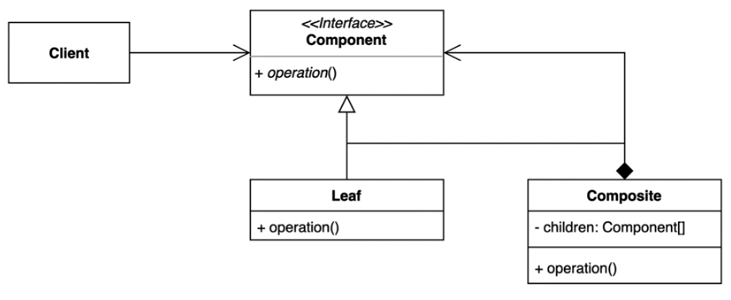

# [구조적인 패턴] Bridge Pattern

- Client는 Component라는 interface만 사용한다.
- Leaf는 가장 기본적인 타입이 된다.
- Composite 은 여러 그룹의 Component를 갖고있다.
- Composite 은 절대로 Leaf 타입을 참조하면 안된다, Component를 참조해야한다.

## 장단점

### 장점

- 복잡한 트리 구조를 편리하게 사용할 수 있다.
- 다형성과 재귀를 활용할 수 있다.
- 클라이언트 코드를 변경하지 않고 새로운 엘리먼트 타입을 추가할 수 있다.

### 단점

- 트리를 만들어야 하기 때문에 (공통된 인터페이스를 정의해야 하기 때문에) 지나치게 일반화 해야 하는 경우도 생길 수 있다.
- Component의 구체적인 타입을 체크하게 되는 경우에는 Composite 패턴을 사용하는게 적절한지 다시 한번 생각해봐야한다.

## 실무

### Java Swing

- Component가 Component Interface로 볼 수 있고, JFrame이 Composite, JTextField와 JButton이 Leaf라고 볼 수 있다.