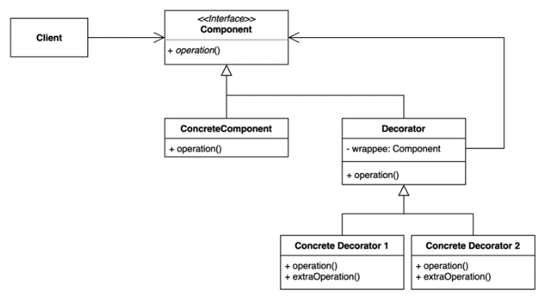

# [구조적인 패턴] Decorator pattern

- 기존 코드를 변경하지 않고 부가 기능을 추가하는 패턴
- 부가기능을 Dynamic하게 Runtime에 추가할 수 있다.
- 상속을 사용하면 유용하지 않기 때문에 위임을 사용한다.
- Composite pattern과 다르게 여러개의 Component를 갖고있는게 아니라 Decorator가 감싸고 있는 Wrappee라는 하나의 Component를 갖는다.
- 각 Decorator들은 각각의 일만하면되고, 조합은 다른 곳에서 하게된다.

## 장단점

### 장점

- 새로운 클래스를 만들지 않고 기존 기능을 조합할 수 있다.(SRP)
- 상속을 이용하면 각 데코레이터들의 조합이 정적인 코드로 정의되어있으야 하는데, Decorator pattern을 이용하면 동적인 조합이 가능하다.(OCP)
- Client가 Interface를 사용함으로써 Dependency Inversion 원칙적용이 가능하다.

### 단점

- 데코레이터를 조합하는 코드가 복잡할 수 있다.

## 실무

### Java

- InputStream, OutputStream, Reader, Writer의 생성자를 활용한 랩퍼
- java.util.Collections가 제공하는 메소드들 활용한 랩퍼
- javax.servlet.http.HttpServletRequest/ResponseWrapper

### Spring Framework

- ServerHttpRequestDecorator : 요청에서 로깅할 부분이나, 차단할부분 등에 대해서 데코레이터로 만들 수 있다.