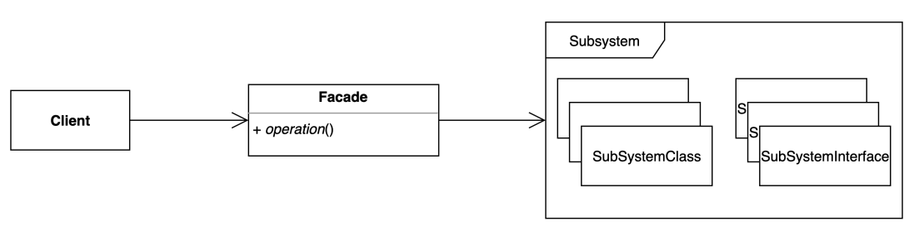

# [구조적인 패턴] Facade pattern



- 복잡한 서브 시스템 의존성을 최소화하는 방법
- 클라이언트가 사용해야 하는 복잡한 서브 시스템(프레임워크/라이브러리) 의존성을 간간한 인터페이스로 추상화할 수 있다.
- 아래 코드는 Email을 보내는 JAVA 코드인테 의존성이 굉장히 많아 복잡해보인다.

```java
import javax.mail.Message;
import javax.mail.MessagingException;
import javax.mail.Session;
import javax.mail.Transport;
import javax.mail.Session;
import java.util.Properties;

public class Client {

    public static void main(String[] args) {
        String to = "cilent@mail.com";
        String from = "service@mail.com";
        String host = "127.0.0.1";

        Properties properties = System.getProperties();
        properties.setProperty("mail.smtp.host", host);

        Session session = Session.getDefaultInstance(properties);

        try {
            MimeMessage message = new MimeMessage(session);
            message.setFrom(new InternetAddress(from));
            message.addRecipien(Message.RecipientType.TO, new InternetAddress(to));
            message.setSubject("Test Mail from Java");
            message.setText("message");

            Transport.send(message);
        } catch (MessagingException e) {
            e.printStackTrace();
        }
    }
}
```

- 퍼사드 패턴을 사용함으로써 좀 더 유연해질 수 있다.
- 테스트 상에서 목킹하기가 더 쉽다.(기존의 코드에서는 static method를 사용하고, 서로 간에 생성이 얽혀 있어서 목킹이 힘들다.)
- EmailSender를 Interface로 만들어 사용할 수 있다는 부분에서도 좀 더 유연해질 수 있다.

## 장단점

### 장점

- 서브시스템에 대한 의존성을 한 곳으로 모을 수 있다.
- 기존에는 MimeMessage, Session, Properties 등에 대해서 잘 알아야하지만, 퍼사드 패턴을 통해서 추상화가 가능하다.

### 단점

- 퍼사드 클래스가 서브 시스템에 대한 모든 의존성을 가지게 된다.

## 실무

### Spring Framework

Decorator pattern과 비슷한 내용들을 예시로 들 수 있는데, 디자인 패턴은 관점의 차이라고 볼 수 있다.

클라이언트가 특정 기술에 종속적인 코드를 사용하지 않고, 기술에 독립적인 인터페이스들을 쓰도록 인터페이스를 설계했다고 보이면 퍼사드 패턴이 적용되었다고 볼 수 있다.

- EmailSender : JavaMailSenderImpl에 기능들이 모두 들어가있다.(퍼사드)
- PlatformTransactionManager : TransactionTemplate이 추상적인 부분, PlatformTransactionManager이 구체적인 부분을 담당한다.