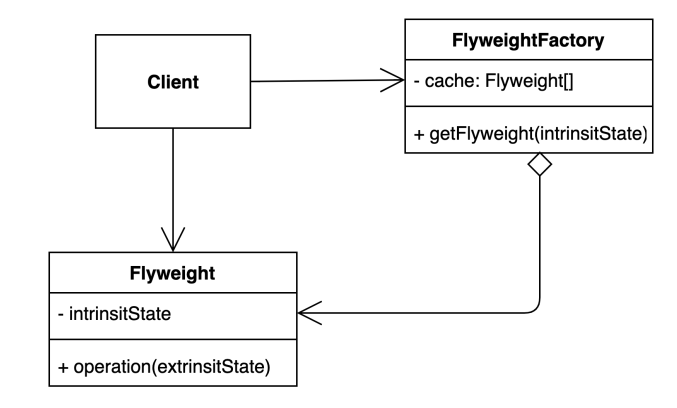

# [구조적인 패턴] Facade pattern

- 객체를 가볍게 만들어 메모리 사용을 줄이는 패턴
- 애플리케이션에서 많은 인스턴스를 만들어야하 특징이 있을 때, 사용 가능.(패턴을 사용해 공통된 부분을 재사용해 메모리를 최적화)
- 자주 변하는 속성(또는 외적인 속성, extrinsit)과 변하지 않는 속성(또는 내적인 속성, intrinsit)을 분리하고 재사용하여 메모리 사용을 줄일 수 있다.
- 잘 변하지 않는 것들을 따로 모아(Flyweight)서 재사용 하는 패턴
- Flyweight를 FlyweightFactory를 통해서 가져다 쓴다.
- 한 번 동일한 속성으로 만들어 둔 Flyweight은 FlyweightFactory에서 캐싱

## 장단점

### 장점

- 애플리케이션에서 사용하는 메모리를 줄일 수 있다.

### 단점

- 복잡도가 증가해서 Facade pattern에 대한 사전지식이 없을 경우에 코드에 대한 이해가 어려워질 수 있다.

## 실무

도메인 관련해서 메모리를 최적화하기 윈한 패턴이라 찾기가 쉽지는 않다.

### Java valueOf

> Cache to support the object identity semantics of autoboxing for values between -128 and 127 (inclusive) as required by JLS. The cache is initialized on first usage. The size of the cache may be controlled by the {@code -XX:AutoBoxCacheMax=<size>} option. During VM initialization, java.lang.Integer.IntegerCache.high property may be set and saved in the private system properties in the jdk.internal.misc.VM class.

- Java Integer의 valueOf는 특정 범위의 숫자를 캐싱해서 사용한다.