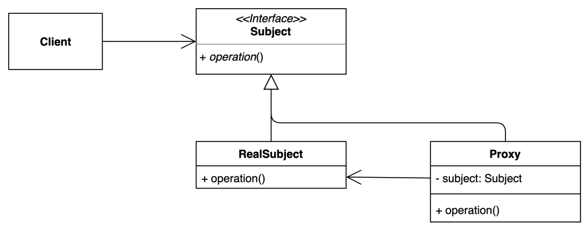

# [구조적인 패턴] Proxy pattern

- Proxy는 대리인이라는 뜻이다.
- 특정한 객체의 operation들을 접근하기 전에 Proxy 객체를 먼저 지나서 접근하는 패턴
- 클라이언트가 원래 사용하려고 했던 Operation을 직접 사용하는 것이 아니라 Proxy라는 중간 대리인을 거쳐서 사용하게 된다.
- 접근제어, 초기화지연, 로깅, 캐싱 등에 사용될 수 있다.
- Decorator 패턴과 생김새가 매우 비슷하다.

## 장단점

### 장점

- 기존 코드를 변경하지 않고 새로운 기능을 추가할 수 있다.(OCP)
- 기존 코드가 해야하는 일만 유지할 수 있다.(SRP)
- 기능 추가 및 초기화 지연 등으로 다양하게 활용할 수 있다.

### 단점

- 코드의 복잡도가 증가한다.

## 실무

### Java Dynamic Proxy

- Reflection을 이용한 Dynamic Proxy

### Spring AOP

- Java Dynamic Proxy를 이용해서 Proxy Bean을 만들어준다.
- @Transactional, @Cacheable 등이 포함된다.